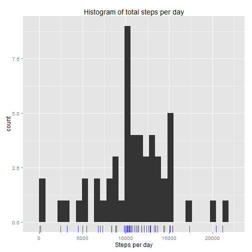
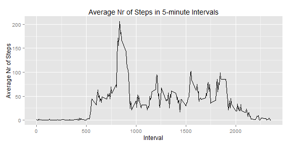
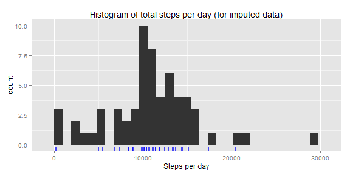
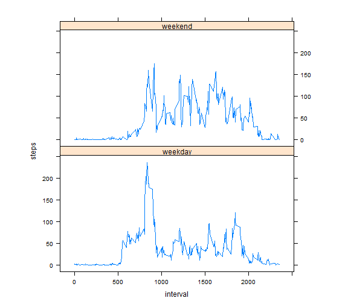

# Reproducible Research: Peer Assessment 1

Daily walking activity data

## Loading and preprocessing the data


```r
unzip("./activity.zip") 
data <- read.csv("./activity.csv")
```

Let's see what's inside:

```r
head(data)
```

```
##   steps       date interval
## 1    NA 2012-10-01        0
## 2    NA 2012-10-01        5
## 3    NA 2012-10-01       10
## 4    NA 2012-10-01       15
## 5    NA 2012-10-01       20
## 6    NA 2012-10-01       25
```

```r
tail(data)
```

```
##       steps       date interval
## 17563    NA 2012-11-30     2330
## 17564    NA 2012-11-30     2335
## 17565    NA 2012-11-30     2340
## 17566    NA 2012-11-30     2345
## 17567    NA 2012-11-30     2350
## 17568    NA 2012-11-30     2355
```

```r
str(data)
```

```
## 'data.frame':	17568 obs. of  3 variables:
##  $ steps   : int  NA NA NA NA NA NA NA NA NA NA ...
##  $ date    : Factor w/ 61 levels "2012-10-01","2012-10-02",..: 1 1 1 1 1 1 1 1 1 1 ...
##  $ interval: int  0 5 10 15 20 25 30 35 40 45 ...
```

```r
summary(data)
```

```
##      steps               date          interval   
##  Min.   :  0.0   2012-10-01:  288   Min.   :   0  
##  1st Qu.:  0.0   2012-10-02:  288   1st Qu.: 589  
##  Median :  0.0   2012-10-03:  288   Median :1178  
##  Mean   : 37.4   2012-10-04:  288   Mean   :1178  
##  3rd Qu.: 12.0   2012-10-05:  288   3rd Qu.:1766  
##  Max.   :806.0   2012-10-06:  288   Max.   :2355  
##  NA's   :2304    (Other)   :15840
```

How many missing values are there?

```r
sum(is.na(data))
```

```
## [1] 2304
```

```r
sum(is.na(data$steps))
```

```
## [1] 2304
```
We see that all missing values are in "steps" column.  

## What is mean total number of steps taken per day?

Let's look at a simple a histogram.

```r
steps.per.day <- tapply(data$steps, data$date, sum)

library(ggplot2)
qplot(steps.per.day, geom="histogram", binwidth=diff(range(steps.per.day, na.rm=TRUE)) / 30) + 
		geom_rug(color="blue", alpha=0.7) + 
		labs(x="Steps per day", title="Histogram of total steps per day")
```

 

and at mean and median values:

```r
mn <- mean(steps.per.day, na.rm=TRUE)
md <- median(steps.per.day, na.rm=TRUE)
mn
```

```
## [1] 10766
```

```r
md
```

```
## [1] 10765
```

The mean number of total steps per day is **1.0766 &times; 10<sup>4</sup>** and the median is **10765**.


## What is the average daily activity pattern?

Daily activity pattern averaged within each five minute interval across all days:


```r
library(plyr)
# Split by intervals, find means
int.means <- ddply(data, "interval", summarise, mean=mean(steps, na.rm=TRUE))
ggplot(int.means, aes(interval, mean)) + geom_path() + 
				labs(title="Average Nr of Steps in 5-minute Intervals", x="Interval", y="Average Nr of Steps")
```

 

Which 5-minute interval, on average across all the days in the dataset, contains the maximum number of steps?

```r
idx <- which.max(int.means$mean)
int.means[idx,]
```

```
##     interval  mean
## 104      835 206.2
```

The interval with the maximum number of steps when averaged across all days in the dataset is **interval 835**.

## Imputing missing values

Let's have a closer look at incomplete cases:


```r
incomplete.cases <- sum(is.na(data$steps))
incomplete.cases
```

```
## [1] 2304
```
There are **2304** incomplete cases in the dataset. Let's look athow they are distributed in time.


```r
interval.na <- ddply(data, "interval", summarise, na.count=sum(is.na(steps)))
head(interval.na)
```

```
##   interval na.count
## 1        0        8
## 2        5        8
## 3       10        8
## 4       15        8
## 5       20        8
## 6       25        8
```

```r
tail(interval.na)
```

```
##     interval na.count
## 283     2330        8
## 284     2335        8
## 285     2340        8
## 286     2345        8
## 287     2350        8
## 288     2355        8
```

It seems that there are always 8 missing values. Let's check:


```r
all(interval.na$na.count == 8)
```

```
## [1] TRUE
```

Indeed! 
This probably means that there were 8 days with no data collected. 
To check this:


```r
date.na <- ddply(data, "date", summarise, na.count=sum(is.na(steps)))
head(date.na)
```

```
##         date na.count
## 1 2012-10-01      288
## 2 2012-10-02        0
## 3 2012-10-03        0
## 4 2012-10-04        0
## 5 2012-10-05        0
## 6 2012-10-06        0
```

```r
sum(date.na$na.count != 0)
```

```
## [1] 8
```

Which dates were these?


```r
dates.with.nas <- unique(date.na$date[date.na$na.count != 0])
as.vector(dates.with.nas)
```

```
## [1] "2012-10-01" "2012-10-08" "2012-11-01" "2012-11-04" "2012-11-09"
## [6] "2012-11-10" "2012-11-14" "2012-11-30"
```

We expect that activity patterns depend on weekday (less walking on weekends or vice versa)
Let's impute missing days' values by mean values of that weekday.

First, let's find wich day of week is the corresponding date.


```r
data$weekday <- factor(weekdays(as.Date(data$date)))
head(data)
```

```
##   steps       date interval     weekday
## 1    NA 2012-10-01        0 понедельник
## 2    NA 2012-10-01        5 понедельник
## 3    NA 2012-10-01       10 понедельник
## 4    NA 2012-10-01       15 понедельник
## 5    NA 2012-10-01       20 понедельник
## 6    NA 2012-10-01       25 понедельник
```

Which weekdays are these?


```r
weekdays.with.na <- unique(data[data$date %in% dates.with.nas,]$weekday)
```

Interval means for each weekday


```r
int.d.means <- ddply(data, c("interval", "weekday"), summarise, steps=mean(steps, na.rm=TRUE))
```

Now let's question whether or not computing the mean by weekday is going to be
any more informative than just substituting the overall mean across all days
(this is a bit of foreshadowing for the next question):

Fill in the missing values


```r
cmpl <- data[complete.cases(data),]
incmpl <- data[!complete.cases(data),]
merged <- merge(incmpl[, c("weekday", "interval", "date")], int.d.means, by=c("interval", "weekday"))
imputed <- rbind(cmpl, merged)
sum(!complete.cases(imputed)) # 0 
```

```
## [1] 0
```

A histogram, mean and median of imputed data: 


```r
imp.steps.p.d <- tapply(imputed$steps, data$date, sum)
qplot(imp.steps.p.d, geom="histogram", binwidth=diff(range(imp.steps.p.d, na.rm=TRUE)) / 30) + 
			geom_rug(color="blue", alpha=0.7) + 
			labs(x="Steps per day", title="Histogram of total steps per day (for imputed data)")
```

 

```r
imp.mn <- mean(imp.steps.p.d, na.rm=TRUE)
imp.md <- median(imp.steps.p.d, na.rm=TRUE)
imp.mn
```

```
## [1] 10821
```

```r
imp.md
```

```
## [1] 11015
```

After imputation mean is **1.0821 &times; 10<sup>4</sup>** and median is **1.1015 &times; 10<sup>4</sup>**.  
These are both different from the values before imputation: 1.0766 &times; 10<sup>4</sup>, 10765, respectively.


## Are there differences in activity patterns between weekdays and weekends?

Let's add a *weekend/weekday* boolean indicator to the data frame with imputed values:


```r
imputed$day=ifelse(as.POSIXlt(as.Date(imputed$date))$wday%%6==0, "weekend","weekday")
imputed$day=factor(imputed$day,levels=c("weekday","weekend"))
stepsInterval2=aggregate(steps~interval+day,imputed,mean)
library(lattice)
xyplot(steps~interval|factor(day),data=stepsInterval2, aspect=1/2, type="l")
```

 

An obvious difference is that activity starts later on weekends.


